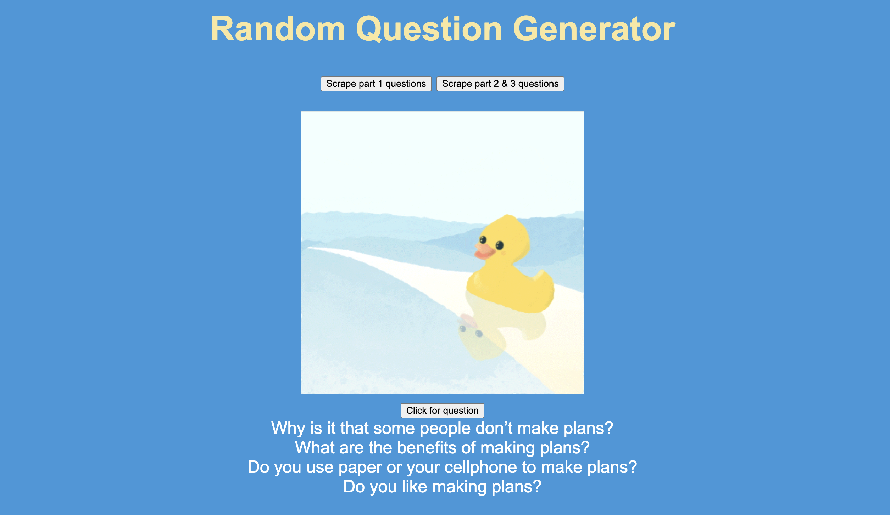

# random-question-generator

## Table of Contents
1. [Introduction](#introduction)
2. [Overview](#overview)

## 1. Introduction
This is a small project providing a basic interface to scrape IELTS Speaking questions from https://next.ieltsbro.com/forecast/ and then random questions for me to practice while I learning IETLS several years ago. Nowadays, people tend to effectively practice with some powerful AI Agent instead of this classic way.

## 2. Overview

  

